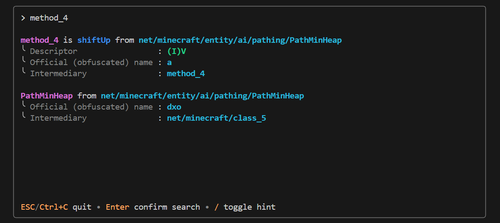
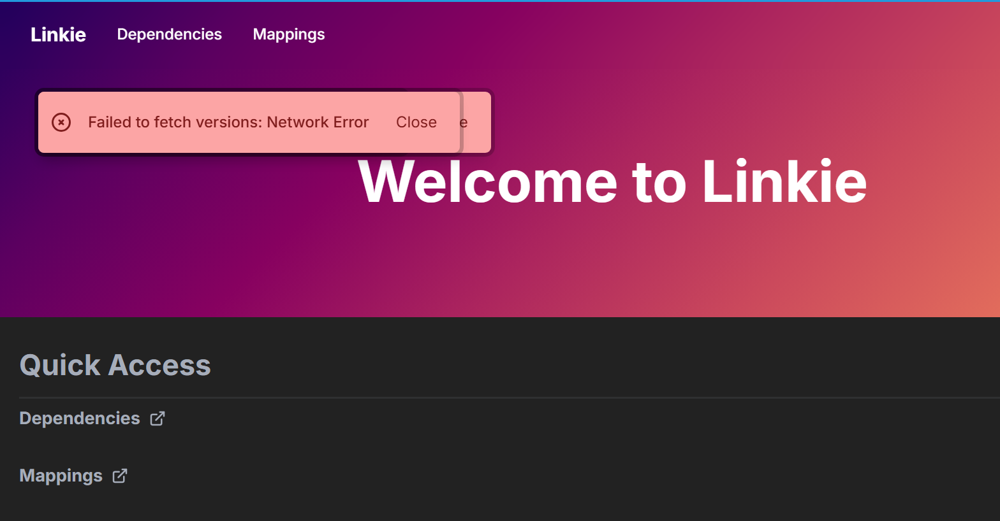
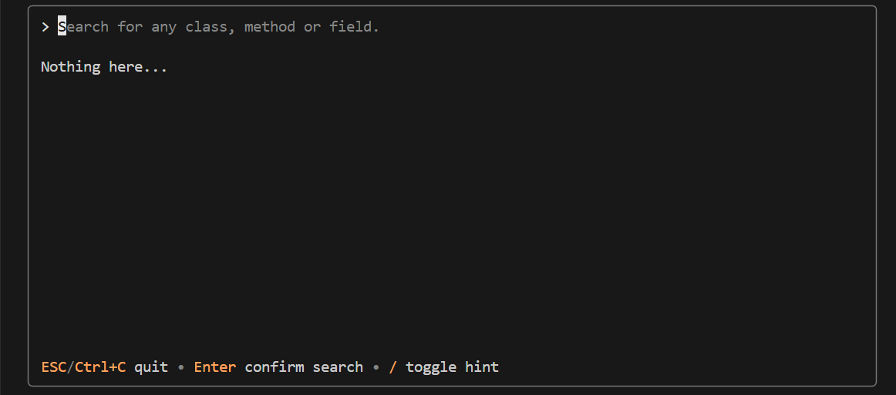

# A little hacked-together project.
A super minimal program that literally allow you to search some intermediary name inside `.tiny` v1 mapping directly on your terminal.


Basically, it allows you to:
- Search intermediary names, example: `class_5`, `field_44922`, `method_103`, ...
- Search named names, example: `SharedConstants`, ...
- Search nested class, example: `class_2841$class_6563`, ...

# Why you make this?
I don't know why [Linkie](https://linkie.shedaniel.dev/mappings) currently doesn't load anything...? So I make this one to quickly search something fast.


# Try my hack... I think
To use it, first: 
- Go to [their maven repositry](https://maven.fabricmc.net/net/fabricmc/yarn/).
- Choose the minecraft version you want to.
- Download the archive that contains `-tiny` prefix, and extract it.

To verify that the mapping you downloaded is v1, it should start with this line:
```
v1	official	intermediary	named
```

Then running `smolmap` with this:
```
smolmap -tiny /path/to/your/tiny/v1-mapping.tiny
```

In case nothing go wrong, that command should show you this empty view right here:


Type the name you want to search, and it will give you the result back. 

# Messing with my horrible code for yourself
Make sure you have [`go`](https://go.dev/dl/) downloaded, then clone this repo by using:
```bash
git clone https://github.com/lilunderDuck/smol-map ./your-directory
cd ./your-directory
```

Then you can build the whole thing:
```bash
# If you have justfile installed
just build

# If you don't have justfile installed
go build -o ./out/smolmap.exe ./src
```

And you're good to go! Just run this command, and you're ready:
```bash
# if you already download .tiny v1 mapping for yourself
./out/smolmap.exe -tiny /path/to/your/tiny/v1-mapping.tiny

# or if you don't or just want to mess around
./out/smolmap.exe -tiny ./tiny/yarn-1.20.1-mappings.tiny
```